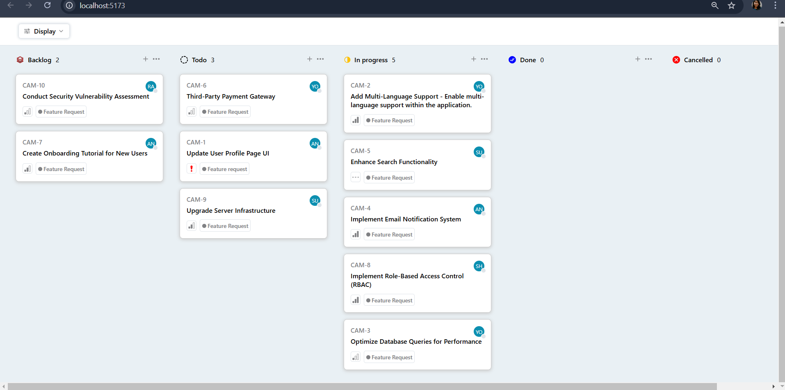
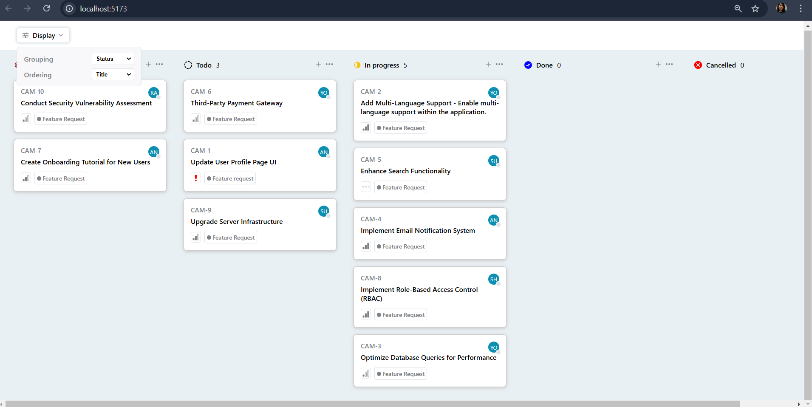

This is a simple and interactive Kanban Board built using React.js for the frontend. The application allows users to manage tasks efficiently by grouping and sorting them dynamically.
The Kanban Board fetches data from an external API and provides a visually organized interface.

**Display:**

**Sorting:**

**Features:**

✅ Dynamic Grouping: Organize tasks by Status, User, or Priority.

✅ Sorting Options: Sort tasks by Priority (descending) or Title (ascending).

✅ Persistent View State: The last selected view persists after a page reload.

✅ API Integration: Fetches task data from a live API.

**How to Run the Project:**

1️⃣ Download the ZIP file and extract it.

2️⃣ Open a terminal inside the project folder.

3️⃣ Install dependencies by running:

npm install

4️⃣ Start the development server with:

npm run dev

5️⃣ Open localhost in your browser to view the app.
